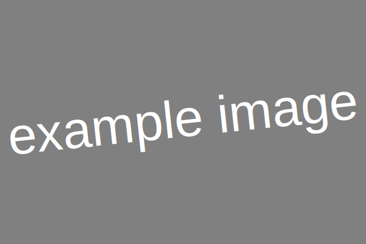

## Ciele

1. {elements} Ukazať použitie elementov scenára
2. {themes} Dokumentovať generované HTML pre autorov tém
3. {test} Automaticky testovať správnosť generovaného HTML

## Úvod

Stručný úvod do problematiky preberanej na cvičení, motivácia.

## Krok {elements}

Postup cvičenia je rozdelený na kroky.

## Krok: Nadpis kroku {elements themes}

Krok môže mať nepovinný nádpis.

## Krok: Príklady špeciálnych blokov použiteľných v krokoch {elements themes test}

> Úloha:
> Element task opisuje práve jednu úlohu, ktorú majú študenti vyriešiť.
> Element task opisuje práve druhu úlohu, ktorú majú študenti vyriešiť.

> Solution*:
> ### fix this  


> Result*:
> # fix this


> Poznámka:
> Element comment obsahuje doplňujúci komentár ku riešenému kroku alebo úlohe.

> Upozornenie:
> Upozornenie je špeciálny typ komentára.

```python
print('Hello World!')
```

> Vyučujúci:
> Text viditeľný iba pre vyučujúceho.

> Example:
> je špeciálny typ komentára.

> Wrong example: Tot
> je špeciálny typ komentára.



hlavička | tabuľky
---------|--------
prvý     | riadok
druhý    | riadok

## Zdroje

1. Opis zdroja, ktorý študenti používajú pri štúdiu modulu.

## Doplňujúce zdroje

- Opis zdroja, ktorý študenti používajú pri štúdiu modulu.

